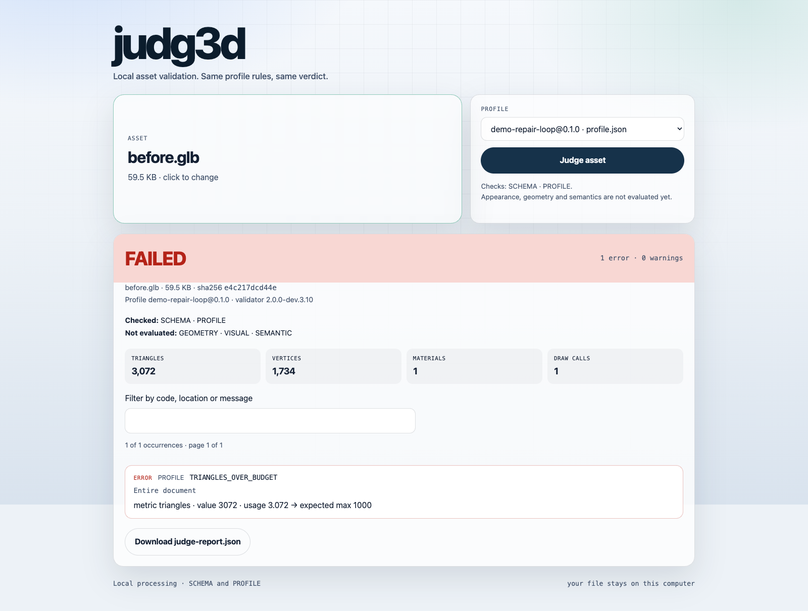

# judg3d

[](https://github.com/victorsodre/judg3d/actions/workflows/ci.yml)

Local acceptance checks for glTF/GLB assets. An asset and a versioned profile
produce a verdict with actionable violations, metrics, hashes and explicit
coverage. Format validation uses the official
[Khronos glTF Validator](https://github.com/KhronosGroup/glTF-Validator).

**0.1.0 release candidate.** This repository contains the working CLI, MCP server
and local app. The historical `judg3d@0.0.1` npm package only reserves the name.
This implementation is MIT-licensed. Install the candidate from source;
version 0.1.0 has not been published to npm.

## Get started

Requires Node **22.13.0 or later** and pnpm **11.22.0**.

```sh
git clone https://github.com/victorsodre/judg3d.git
cd judg3d
pnpm install --frozen-lockfile
pnpm build
pnpm judg3d judge fixtures/valido.glb --profile profiles/web-commerce.json
pnpm judg3d judge fixtures/quebrado.glb --profile profiles/web-commerce.json
pnpm judg3d app
```

The app prints its local address, defaulting to `http://127.0.0.1:8787`.
Choose an asset and profile, then run the analysis. Results show coverage,
searchable violations and a downloadable report. Changing the asset or profile
clears the previous result. Press `Ctrl+C` to stop the server.

## See what the gate proves

```sh
pnpm demo
```

The same format-valid Box passes SCHEMA and fails a deliberately small triangle
budget. A broken asset returns actionable diagnostics; a missing profile returns
infrastructure failure without a verdict. The demo checks repeated JSON output
and input hashes. See the [reproduction guide](examples/acceptance-gate/README.md)
and [case study](docs/case-study.md).

The local interface shows exactly which checks ran:



## Language

English is the default for the interface, CLI, API, MCP and generated reports.
The **Language** selector offers **English** and **Português (Brasil)**. An explicit
choice is saved in this browser; browser language does not override the initial
English default. If browser storage is unavailable, switching still works for
the current page.

Switching languages preserves the selected inputs and current verdict without
running another analysis. Interface labels and number formatting are localized;
technical diagnostics, profile identifiers and downloaded JSON remain in English.
User-supplied filenames and profile values are preserved as supplied.

## CLI and automation

```sh
# Atomic report write that protects the input files.
pnpm judg3d judge model.glb -p profiles/agent-loop.json -o result.json

# JSON on stdout without creating a report file.
pnpm judg3d judge model.glb -p profiles/agent-loop.json --out -

# Runtime information and installed profile directory.
pnpm judg3d engine
pnpm judg3d profiles
```

| Exit | Meaning                                                 |
| ---- | ------------------------------------------------------- |
| 0    | Asset passed the checks performed                       |
| 1    | Asset failed; a report describes the violations         |
| 2    | Configuration, I/O or processing failed; no new verdict |

Check the exit code before consuming a report file. An infrastructure failure
preserves any existing report, which belongs to an earlier run. `--out -` is
useful for pipelines that do not need persistent files. Human-readable output
shows up to 200 occurrences and points to the full JSON for the remainder.
`--json` prints the same JSON written to disk; `--timestamp` adds an optional date.
With timestamps disabled, identical inputs, paths and runtime produce
byte-identical reports.

## Coverage and profiles

| Layer                      | Available checks                                                                     |
| -------------------------- | ------------------------------------------------------------------------------------ |
| SCHEMA                     | glTF 2.0 conformance through Khronos                                                 |
| PROFILE                    | Triangle, vertex, material, draw-call and image-resolution budgets; self-containment |
| GEOMETRY, VISUAL, SEMANTIC | Unavailable; enabling them returns exit 2                                            |

PASS applies to `coverage.ran`; it does not certify appearance or visual fitness.
`coverage.skipped` lists checks that did not run. External glTF resources are
never fetched or read. Set PROFILE `requireSelfContained: true` to require a
portable file with embedded resources.

`web-commerce` enables SCHEMA only; its name does not imply universal commerce
budgets. `agent-loop` enables SCHEMA and PROFILE with limits from a specific
pipeline. Copy it and choose limits for your project. See
[profiles/README.md](profiles/README.md).

`failOn` determines rejection. `report` controls verbosity without changing the
verdict or hiding the severity that caused rejection. Information and Hint retain
their original Khronos severity in `got.severity`; the contract presents them as
`warn`, but they do not cause rejection on their own. `maxPerCode` summarizes
occurrences after validation. A truncated validation caused by `maxIssues`
returns infrastructure failure. Disabling all layers, requesting inheritance
through `extends`, or enabling PROFILE without SCHEMA also returns exit 2.

## MCP for agents

The MCP server exposes `judge_asset` for reading local files. Configure the
absolute path to the built CLI and restrict the workspace to your project:

```json
{
  "mcpServers": {
    "judg3d": {
      "command": "node",
      "args": [
        "/path/to/judg3d/packages/cli/dist/index.js",
        "mcp",
        "--root",
        "/path/to/project"
      ]
    }
  }
}
```

Tool arguments:

```json
{ "asset": "assets/product.glb", "profile": "profiles/product.json" }
```

Both paths, including symlink targets, must remain inside the workspace. The
tool does not write reports or access URLs. It returns `structuredContent` with
`ok`, `exitHint` and `report`. Asset rejection is a normal result (`exitHint: 1`);
infrastructure failures use `isError: true` and `exitHint: 2`. Stdout is reserved
for the protocol.

## Limits and privacy

CLI, MCP and HTTP analysis use workers with a 30-second deadline and a V8 old
generation limit of 256 MiB per analysis; this is not a total RSS cap. Assets
are limited to 64 MiB and profiles to 1 MiB. MCP and HTTP allow at most two
concurrent analyses. Exceeding processing limits returns infrastructure failure.

The app binds to `127.0.0.1`, validates hostname and origin, blocks framing,
and prevents static-file access to dotfiles and symlinks outside its root.
There is no telemetry, remote upload or external font request. Uploads are
processed in memory; reports are written only by the CLI or an explicit download.
Configure the app with `--port` and `--profiles`. For development:

```sh
pnpm app:dev
# UI :5173 and API :8787, with local development origins allowed.
```

The HTTP API is local, without hosted accounts or authentication.
`@judg3d/judge` also exports an in-process `judge()` without worker isolation;
applications processing untrusted assets should use `judgeIsolated()`.

## Verification and release

```sh
pnpm typecheck && pnpm lint && pnpm test
pnpm docs:check
pnpm release:pack
pnpm release:check
```

Packing creates five tarballs and a SHA-256 manifest in `artifacts/release/`.
The check installs them in a clean temporary directory and verifies CLI exit
codes, determinism, MCP over stdio, HTTP UI and uploaded asset analysis. It does
not publish to npm or change GitHub. CI is configured for Node 22.13, 24 and 26.

| Package         | Responsibility                                             |
| --------------- | ---------------------------------------------------------- |
| `@judg3d/core`  | Contracts, profiles, serialization and shared presentation |
| `@judg3d/judge` | SCHEMA/PROFILE layers and isolated execution               |
| `@judg3d/app`   | Local API and interface with bundled profiles              |
| `@judg3d/mcp`   | MCP protocol and workspace restriction                     |
| `judg3d`        | CLI entry points                                           |

Product decisions: [specification](docs/judg3d-spec-v0.md).
Release preparation: [0.1.0 notes](docs/release-0.1.0.md).
Contributor conventions: [AGENTS.md](AGENTS.md).
Historical specification and calibration notes are in Portuguese.

## Contribute and integrate

Start with [CONTRIBUTING.md](CONTRIBUTING.md), the [architecture](docs/architecture.md)
and [agent integration guide](docs/agent-integration.md). Useful contributions
include reproducible edge cases, downstream integration feedback and onboarding
improvements. See the [roadmap](ROADMAP.md), [security policy](SECURITY.md),
[support](SUPPORT.md) and [governance](GOVERNANCE.md).

## License

[MIT](LICENSE) for judg3d's original source and documentation.
Dependencies and sample assets retain their own licenses; see
[third-party notices](THIRD_PARTY_NOTICES.md) and
[fixture attribution](fixtures/README.md). Sample assets are excluded from npm packages.
