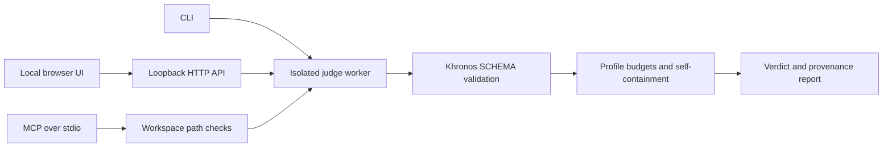

# Architecture and trust boundaries

judg3d separates deterministic asset acceptance from presentation and transport.
Its current scope is SCHEMA and PROFILE. It does not implement a renderer,
geometry engine, repair system or semantic judge.

| Package | Responsibility                                                                             |
| ------- | ------------------------------------------------------------------------------------------ |
| core    | Strict profile parsing, contracts, hashes, report/compare serialization, presentation      |
| judge   | Khronos integration, PROFILE rules and isolated worker execution                           |
| app     | Local HTTP transport and English/pt-BR interface                                           |
| mcp     | Official SDK transport and read-only workspace-restricted tools                            |
| cli     | Commands (`judge`, `compare`), exit codes, terminal presentation and atomic report writing |

## Invariants

The engine computes the verdict before presentation filters. `report` and
`maxPerCode` may change displayed details, not acceptance. Interrupted validation,
unimplemented requested layers and invalid configuration produce infrastructure
failure, never PASS. Thresholds live in profiles. Coverage names every executed
and skipped layer. Hashes identify original asset/profile bytes; timestamps are
opt-in. Runtime and URI metadata also affect serialized report bytes.

Received reports are checked for internal consistency before the UI accepts them:
nonempty coverage, matching engine layers, disjoint executed/skipped layers,
valid counters and diagnostics consistent with the verdict. These checks catch
malformed responses; they do not cryptographically authenticate a server or
independently recompute the result. Nested presentation is bounded while raw
report data remains available in JSON.

## Input and execution boundaries

Regular-file reads are bounded. The CLI protects input paths from report writes
and escapes terminal control characters. HTTP uploads are size/concurrency
limited; the service checks request origin and hostname. Static files are
restricted to the built client directory. MCP resolves paths and symlinks within
its selected root. The validator never fetches referenced external resources.

Workers limit processing time and V8 old-generation memory. They share the
operator's OS privileges and are not an OS security sandbox. Do not let another
local actor mutate the workspace or its ancestors concurrently. For a stronger
threat boundary, run the application in an appropriate OS sandbox.

## Evidence and limits

Tests exercise invalid assets/configuration, truncation, contradictory reports,
large diagnostics, cancellation, path escapes, HTTP boundaries and real MCP
transport. The clean-install check exercises packed artifacts. The demo ties
three verdicts and an infrastructure error to reproducible inputs.

`judg3d compare` runs two isolated `judge` evaluations with the same loaded
profile, then derives a compare document. Profile identity is the SHA-256 of
the original profile bytes; a mismatch is infrastructure failure, not a
verdict. Runtime (`gltf-validator`, Node) differences are recorded and never
interpreted as visual PASS. Coverage intersection is the only comparable
layer set. Texture (and other optional) deltas are omitted unless both
reports measured that field, so an unperformed check cannot become a zero.

See [security](../SECURITY.md), [profiles](../profiles/README.md), and the
[original specification](judg3d-spec-v0.md). The historical vision includes
capabilities that remain outside this release; [ROADMAP.md](../ROADMAP.md)
describes the current direction.
